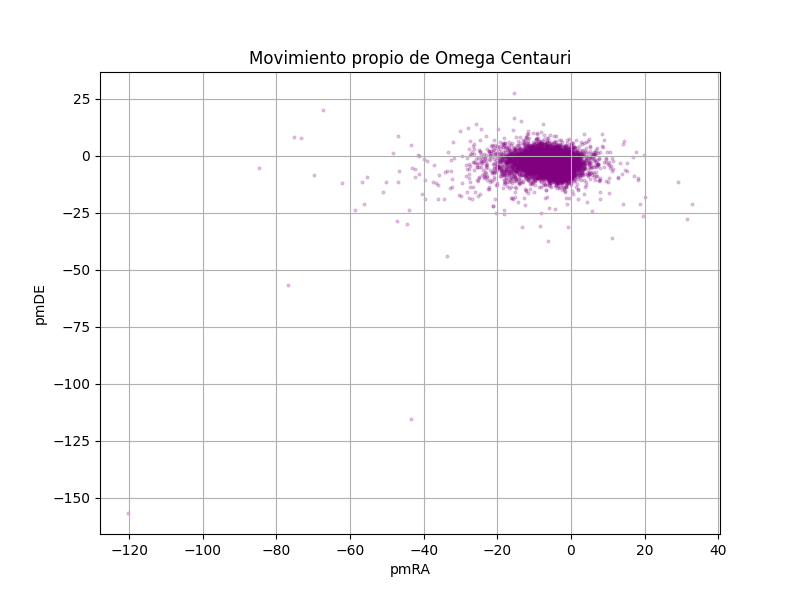
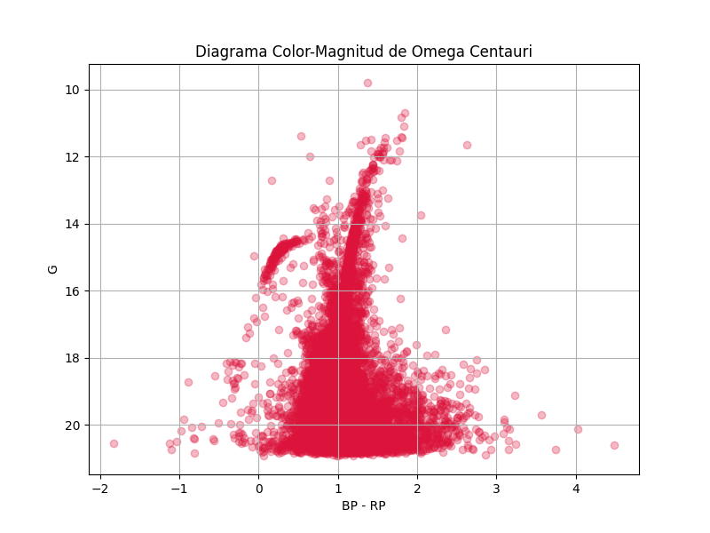

# **Proyecto 2 - Sofía Lorena Casallas Beltrán**

## **Arqueología Galáctica y el Misterio de Omega Centauri**

### **Coordenadas**
- **Ascensión recta:** 201.6967
- **Declinación:** -47.4795

Este repositorio contiene el archivo `1_descarga_omega.sh` que descarga 
los datos de la misión Gaia DR3, con el archivo extraido, en `2_crear_db.py` se limpian
los datos para que tenga valores NaN, esto para finalmente utilizarlos en
`3_analisis.py` donde se  genera el diagrama de movimiento propio y el diagrama 
Color-Magnitud de Omega Centauri.

### *Resultados**

#### **Gráfica 1: Movimiento Propio**

En esta gráfica se distingue los dos grupos esperados desde la teoría, una nube con estrellas que pertenecen a la Vía Láctea y un racimo denso que corresponde a Omega Centauri, el cual se busca definir su tamaño para analizar exclusivamente las estrellas de este cúmulo. Para verificar cuales eran las que tenían el mismo vecotr de movimiento se utilizó una transparencia, lo que permitió visualizar que en las zonas más oscuras, donde se forma el racimo, son estrellas que se encuentran gravitacionalmente ligadas, por lo que pertenecen ala mismo cúmulo. 
Se definió el rango de este racimo entre *pmRA*=[-8,2] y *pmDE*=[-10,1], valores elegidos usando la gráfica 1.

#### **Gráfica 2: Diagrama Color-Magnitud**

Al aplicar el filtro SQL con los rangos seleccionados gracias a la gráfica anterios, se delimita el racimo cinemático y al graficar el Color vs Magnitud se ve la estructura evolutiva estelar de Omega Centauri, que es lo esperado. Sin el filtro, las estrellas de la Vía Láctea que se encuentran a diferentes distancias, con edades y composiciones químicas diferentes a las del cúmulo, distorsionarían el diagrama produciendo una nube de puntos sin la estructura de diagrama HR que se espera. En la gráfica 2 se aprecia así:

- Se observa la **Main Sequence** como la franja diagonal densa.
- La **RGB** como la línea que asciende entre los colores de 1 y 2.
- Y finalmente, la **HB** con magnitudes entre 14 y 15.

Se concluye así que al filtrar por movimiento propio se puede aislar una población estelar coherente y reconstruir la historia de esta a pesar de tener lla información contaminada por daos provenientes de otras fuentes, en este caso, la Vía Láctea.
